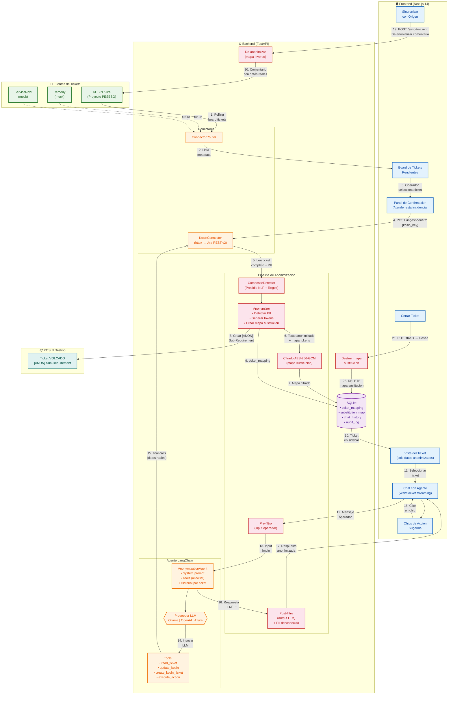

# Diagrama de Proceso General — Plataforma de Anonimizacion de Ticketing

> **NTT DATA EMEAL** — Sistema de intermediacion GDPR-compliant para soporte offshore
> Version 1.6 — 15 de Marzo de 2026

---

## Flujo End-to-End

---

## Leyenda de colores

| Color | Componente |
|-------|-----------|
| 🟢 Verde | Fuentes de tickets (KOSIN, Remedy, ServiceNow) |
| 🔵 Azul | Frontend (interfaz del operador) |
| 🟠 Naranja | Backend (conectores, agente, tools) |
| 🟣 Morado | Base de datos (SQLite) |
| 🔴 Rojo | Pipeline de anonimizacion (deteccion, cifrado, filtros) |
| 🟦 Teal | KOSIN destino (tickets volcados [ANON]) |

---

## Resumen de flujos

### Flujo 1 — Ingesta (pasos 1-10)
El operador ve tickets pendientes en el board, selecciona uno y confirma. El backend lee el ticket completo con PII desde KOSIN, lo pasa por el CompositeDetector (Presidio NLP + Regex), genera tokens anonimizados, cifra el mapa de sustitucion con AES-256-GCM, crea una copia [ANON] en KOSIN y guarda todo en SQLite.

### Flujo 2 — Chat con agente (pasos 11-18)
El operador interactua via chat WebSocket. Su input pasa por un pre-filtro PII. El agente LangChain (configurable: Ollama/OpenAI/Azure) razona con el contexto anonimizado y ejecuta tools controladas. La respuesta del LLM pasa por un post-filtro que detecta PII conocido (mapa) y desconocido (regex fresco). El agente sugiere acciones via chips clickeables.

### Flujo 3 — Cierre (pasos 19-22)
El operador puede sincronizar comentarios al ticket origen (de-anonimizando con el mapa inverso). Al cerrar el ticket, el mapa de sustitucion se destruye permanentemente, garantizando el derecho al olvido GDPR.
