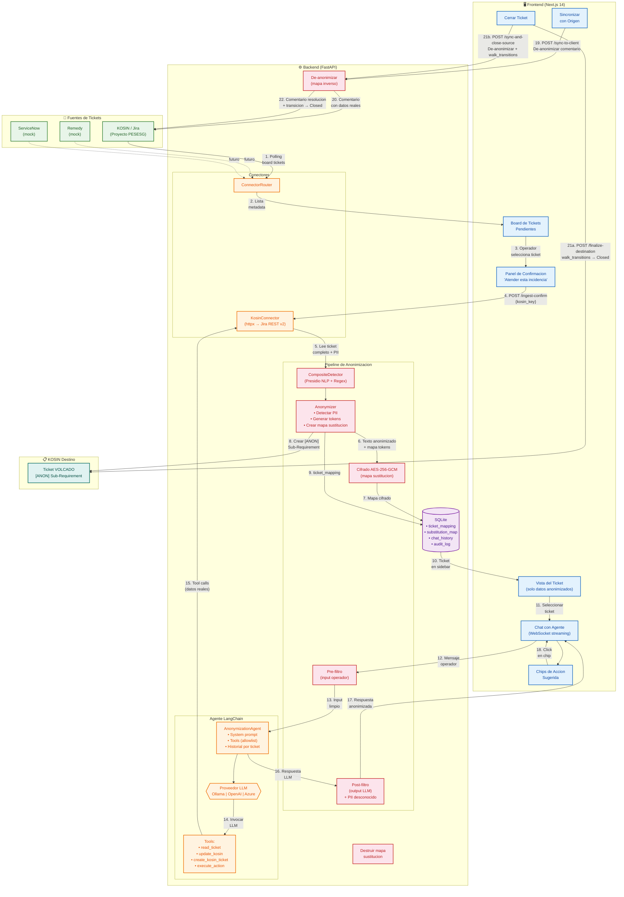

# Propuesta de Arquitectura: Plataforma de Anonimizacion de Ticketing

**Version:** 1.9
**Fecha original:** 13 de Marzo de 2026
**Ultima actualizacion:** 20 de Marzo de 2026
**Equipo:** NTT DATA EMEAL
**Estado:** Piloto implementado con Presidio NLP configurable desde UI, multi-cliente (Remedy/ServiceNow), redaccion de imagenes, panel de configuracion funcional (integraciones + anonimizacion + admin tickets), renderizado Markdown en chat, notificaciones toast/modal, soporte tri-provider LLM (Ollama/OpenAI/Azure), test de conexion LLM desde UI, guia de despliegue Azure completa, 56 tests, **arquitectura dual-agent** (LLM anonimizacion + LLM resolucion), **filtros de origen con JQL dinamico**, **buscador en pendientes**, **eliminacion de datos PII de BBDD** (mapa sustitucion reconstruido on-the-fly), **LLM detector adaptativo** (modo full/names-only segun detectores activos), **reconstruccion de mapa inmutable** (siempre usa CompositeDetector), **proteccion anti-re-tokenizacion** (tokens existentes no se re-procesan), **gestion de estados Jira real** (walk_transitions para cerrar tickets destino y origen via API) — pendiente validacion (Fase 4)

---

## 1. Contexto y Problema

### 1.1 Situacion Actual

Los equipos offshore (trabajadores en otros paises) necesitan gestionar tickets de soporte de clientes, pero la normativa GDPR/RGPD impide que accedan a datos personales contenidos en dichos tickets (nombres, emails, telefonos, DNIs, direcciones, IPs, etc.).

### 1.2 Objetivo

Crear una plataforma que permita a los operadores offshore trabajar con tickets de clientes **sin acceder nunca a datos personales**, manteniendo la capacidad operativa completa para resolver incidencias.

### 1.3 Solucion Propuesta

Una **plataforma de intermediacion con anonimización controlada** en la que un agente de IA
asiste al operador offshore sin exponerle datos personales.

- El **backend y los conectores** son las unicas capas con acceso a los datos reales del ticket
- El operador trabaja **siempre sobre una vista anonimizada**
- El agente consulta informacion tecnica y propone o ejecuta acciones dentro de un catalogo controlado
- Todo el trabajo operativo se registra en un sistema interno (KOSIN) en version anonimizada

La barrera GDPR no depende solo del prompt del agente: depende de una combinacion de
anonimizacion previa, control de herramientas, filtro de salida, auditoria y escalado a onshore
cuando no se puede garantizar seguridad suficiente.

---

## 2. Arquitectura General

### 2.1 Vision de Alto Nivel

```
 KOSIN (Jira interno)              PLATAFORMA DE ANONIMIZACION                    OPERADOR
 Proyecto PESESG                                                                  OFFSHORE

                        ┌──────────────────────────────────────────────┐
 ┌─────────────┐        │                                              │   ┌──────────────┐
 │             │        │  1. CONECTORES         2. ANONYMIZER         │   │              │
 │  Ticket     │◄──────►│  ┌──────────────┐      ┌─────────────────┐   │   │  Interfaz    │
 │  con PII    │        │  │ KOSIN source │─────►│ RegexDetector   │   │   │  de Chat     │
 │  (PESESG-*) │        │  │ KOSIN dest.  │      │ Mapa sustitucion│   │   │  (Next.js)   │
 └─────────────┘        │  └──────────────┘      │ Filtro salida   │   │   │              │
                        │        ▲               └────────┬────────┘   │   │  Solo ve     │
                        │        │                        │            │   │  datos       │
                        │        │                        ▼            │   │  anonimizados│
                        │  3. AGENTE LANGCHAIN (Ollama / Azure OpenAI) │   │              │
                        │  ┌──────────────────────────────────────┐    │   └──────┬───────┘
                        │  │ System prompt anonimizador           │    │          │
                        │  │ Tools (allowlist):                   │◄───┼──────────┘
                        │  │   read_ticket · update_kosin         │    │   WebSocket
                        │  │   create_kosin_ticket · exec_action  │    │   (streaming)
                        │  │ Historial por ticket (SQLite)        │    │
                        │  └──────────────────┬───────────────────┘    │
                        │                     │                        │
                        │                     ▼                        │
                        │  ┌──────────────────────────────────────┐    │
                        │  │  KOSIN (Jira interno) — destino      │    │
                        │  │  Ticket VOLCADO [ANON] + audit log   │    │
                        │  └──────────────────────────────────────┘    │
                        │                                              │
                        │  4. ESCALADO ONSHORE (pendiente)             │
                        │  Si no se puede anonimizar con confianza     │
                        │  → bloqueo + derivacion a supervisor         │
                        └──────────────────────────────────────────────┘

 Flujo de datos PII:
 Ticket real → Conectores → Anonymizer (regex + tokens) → Agente (ve tokens) → Operador (ve tokens)
                                                           ▲
                                                           │ Las acciones tecnicas se ejecutan
                                                           │ via tools controladas (simuladas en piloto),
                                                           │ pero el resultado se anonimiza antes
                                                           │ de mostrarse al operador.
```

### 2.1.1 Diagrama de Proceso General (Mermaid)



**Nota POC:** En el piloto, la misma instancia KOSIN (proyecto PESESG) actua como origen y destino.
Los tickets originales se leen del board KOSIN, y las copias anonimizadas se crean como
Sub-Requirements con prefijo `[ANON]` bajo un ticket padre configurado (`KOSIN_PARENT_KEY`).

### 2.2 Principio Fundamental

```
┌──────────────────────────────────────────────────────────────────┐
│                                                                  │
│   El operador NUNCA accede a datos reales.                       │
│   El agente IA es la UNICA entidad que lee datos PII.            │
│   Toda comunicacion hacia el operador pasa por anonimizacion.    │
│   Toda accion tecnica la ejecuta el agente con datos reales.     │
│                                                                  │
└──────────────────────────────────────────────────────────────────┘
```

**Aclaracion de arquitectura:** Aunque el diagrama simplifica el flujo hablando del agente,
en la implementacion real el acceso a PII en claro queda restringido a backend y conectores.
El LLM trabaja por defecto con contexto ya anonimizado y las acciones tecnicas se ejecutan
mediante herramientas controladas y auditadas.

### 2.3 Arquitectura de Componentes (Implementada)

```
┌─────────────────────────────────────────────────────────────────┐
│                FRONTEND (Next.js 14 + TypeScript + Tailwind)     │
│                                                                  │
│  ┌────────────────────┐  ┌───────────────────────────────────┐   │
│  │  Panel de Tickets  │  │         Panel de Chat             │   │
│  │                    │  │                                   │   │
│  │  PENDIENTES:       │  │  Conversacion con el agente IA   │   │
│  │  Tickets del board │  │  sobre el ticket seleccionado.   │   │
│  │  KOSIN aun no      │  │  Toda informacion mostrada esta  │   │
│  │  ingestados.       │  │  anonimizada.                    │   │
│  │                    │  │                                   │   │
│  │  EN ATENCION:      │  │  El operador puede:              │   │
│  │  Tickets ya        │  │  - Preguntar sobre el ticket     │   │
│  │  anonimizados e    │  │  - Dar instrucciones al agente   │   │
│  │  ingestados.       │  │  - Usar chips de accion sugerida │   │
│  │                    │  │  - Finalizar destino / Cerrar orig│   │
│  │  Cada ticket:      │  │                                   │   │
│  │  - ID KOSIN        │  │  Chips de accion sugerida:       │   │
│  │  - Resumen anonim. │  │  Botones clickeables que el      │   │
│  │  - Estado          │  │  agente sugiere al final de cada │   │
│  │  - Prioridad       │  │  respuesta via [CHIPS: "..."]    │   │
│  └────────────────────┘  └───────────────────────────────────┘   │
│                                                                  │
│  Estado global: Zustand (appStore.ts)                            │
│  Comunicacion: fetch() + useWebSocket hook                       │
└──────────────────────────────────┬───────────────────────────────┘
                                   │ REST + WebSocket (streaming)
                                   ▼
┌─────────────────────────────────────────────────────────────────┐
│                     BACKEND (Python + FastAPI)                   │
│                                                                  │
│  ┌───────────────────────────────────────────────────────────┐   │
│  │          Routers (tickets.py + chat.py)                    │   │
│  │                                                           │   │
│  │  La logica de ingesta se implementa directamente en los   │   │
│  │  endpoints del router (no hay orchestrator separado):     │   │
│  │  1. Operador selecciona ticket del board KOSIN            │   │
│  │  2. Endpoint ingest-confirm lee ticket + comentarios      │   │
│  │  3. Anonymizer detecta PII y genera mapa de sustitucion   │   │
│  │  4. Se crea ticket VOLCADO [ANON] en KOSIN como sub-req   │   │
│  │  5. Se guarda mapping + mapa cifrado + descripcion anon.  │   │
│  │  6. Chat via WebSocket con streaming de tokens             │   │
│  └───────────────────────────────────────────────────────────┘   │
│                                                                  │
│  ┌───────────────────────────────┐  ┌──────────────────────┐   │
│  │  Agente LangChain             │  │  Conectores          │   │
│  │  (Ollama local / Azure)       │  │                      │   │
│  │                               │  │  - KOSIN (origen     │   │
│  │  System prompt anonimizador   │  │    y destino en POC) │   │
│  │  + Tools:                     │  │  - Jira (mock o      │   │
│  │    - read_ticket              │  │    real via httpx)    │   │
│  │    - create_kosin_ticket      │  │                      │   │
│  │    - update_kosin             │  │  Interfaz abstracta  │   │
│  │    - execute_action           │  │  TicketConnector      │   │
│  │  + Historial manual desde DB  │  │  (plug & play)       │   │
│  │  + RegexDetector pre/post     │  │                      │   │
│  │  + Chips de accion sugerida   │  │                      │   │
│  └───────────────────────────────┘  └──────────────────────┘   │
│                                                                  │
│  ┌───────────────────────────────────────────────────────────┐   │
│  │                  SQLite (Piloto)                           │   │
│  │                                                           │   │
│  │  - ticket_mapping (+ summary, description, priority)      │   │
│  │  - substitution_map (cifrado AES-256-GCM)                 │   │
│  │  - chat_history (mensajes anonimizados)                   │   │
│  │  - audit_log (acciones registradas)                       │   │
│  └───────────────────────────────────────────────────────────┘   │
└─────────────────────────────────────────────────────────────────┘
```

**Diferencias respecto a la propuesta original:**

| Aspecto | Propuesta v1.0 | Implementacion real |
|---|---|---|
| Orquestador | `services/orchestrator.py` dedicado | Logica distribuida en `routers/tickets.py` |
| Ingesta | Automatica (webhook/polling) | Manual: operador confirma desde el board |
| Frontend | React + TypeScript | Next.js 14 App Router + TypeScript |
| LLM | Solo Azure OpenAI | Configurable: Ollama (dev) / OpenAI (API directa) / Azure (prod) |
| Conector Jira | Libreria `jira` (Atlassian) | `httpx` directo contra Jira REST API v2 |
| Memory agente | `ConversationBufferMemory` (LangChain) | Historial manual cargado desde SQLite |
| Modelos datos | 3 archivos (`database.py`, `ticket.py`, `chat.py`) | 1 archivo `schemas.py` (Pydantic) |
| Crypto/PII filter | Archivos separados en `utils/` | Integrados en `anonymizer.py` |
| Tool `sync_to_client` | Planificada | ✅ **Implementada** (endpoint + de_anonymize + frontend) |
| Volcado inverso a cliente | Planificado (flujo 3.3) | ✅ **Implementado** via sync_to_client |
| Autenticacion JWT | Planificada (Fase 4) | **No implementada** |
| Docker Compose / Dockerfile | Planificados | **No creados** |
| Tests | Planificados | ✅ **35 tests pytest** (anonymizer, attachments, roundtrip) |
| Rate limiter | Planificado | ✅ **Registrado** en app (RateLimiterMiddleware) |
| DetectionService abstracta | Planificada (interfaz) | ✅ **Implementada** (ABC + RegexDetector + AttachmentDetector) |
| Adjuntos (PDF, OCR, Office) | Planificados para fase 2 | ✅ **Implementados** (AttachmentProcessor + tool read_attachment) |
| Chips de accion | No planificados | **Anadidos** — UX significativa |
| Board view (tickets pendientes) | No planificado | **Anadido** — flujo de ingesta manual |

---

## 3. Flujos Principales

### 3.1 Ingesta de Ticket (Implementado)

```
1. Board KOSIN muestra tickets abiertos del proyecto PESESG
   (polling cada 60 segundos desde frontend)
              │
              ▼
2. Operador selecciona un ticket pendiente del board
   Se muestra panel de confirmacion: "Atender esta incidencia"
              │
              ▼
3. Operador confirma → POST /api/tickets/ingest-confirm/{kosin_key}
   Backend lee ticket completo + comentarios via KosinConnector
              │
              ▼
4. Texto del ticket pasa por Anonymizer (RegexDetector)
   Piloto: emails, DNIs, telefonos, IPs (v4), IBANs, nombres
              │
              ▼
5. Se genera mapa de sustitucion:
   {"PERSONA_1": "Juan Garcia", "EMAIL_1": "juan@acme.com", ...}
   Se cifra con AES-256-GCM y se almacena en substitution_map
              │
              ▼
6. Se crea ticket VOLCADO en KOSIN como Sub-Requirement:
   - Prefijo "[ANON]" en el summary
   - Sub-tarea bajo el parent configurado (KOSIN_PARENT_KEY)
   - Descripcion anonimizada
              │
              ▼
7. Se guarda en ticket_mapping (source_key, kosin_key, summary, etc.)
   El ticket aparece en la seccion "En atencion" del panel
              │
              ▼
8. Se genera resumen inicial automatico via el agente
```

**Diferencia con propuesta v1.0:** La ingesta era automatica (webhook/polling desde backend).
En la implementacion el operador la inicia manualmente desde el board, lo cual da mas control
y evita anonimizar tickets que nadie va a atender.

### 3.2 Trabajo del Operador (Chat con Agente) — Implementado

```
OPERADOR selecciona ticket en "En atencion"
              │
              ▼
AGENTE genera resumen inicial anonimizado (generate_initial_summary):
  "Ticket PESESG-123: Se reporta un error de conectividad.
   [PERSONA_1] indica que el servicio no responde desde las 09:00.
   Prioridad: Alta."
  [CHIPS: "Ver logs del sistema", "Verificar estado", "Reiniciar servicio"]
              │
              ▼
OPERADOR hace click en chip "Ver logs del sistema"
   → Se envia como mensaje de chat al agente
   → Se registra como comentario en el ticket VOLCADO en KOSIN
              │
              ▼
AGENTE: (usa tool read_ticket para consultar datos)
        (ejecuta tool execute_action para get_logs)
        (responde anonimizado, post-filtrado por Anonymizer)
  "Los logs muestran errores de conexion a la BD desde las 08:47.
   Error: 'Connection refused on port 5432'."
  [CHIPS: "Reiniciar servicio BD", "Verificar conectividad", "Escalar"]
              │
              ▼
OPERADOR: "Reinicia el servicio de base de datos"
              │
              ▼
AGENTE: (execute_action: restart_service — simulado en piloto)
  "He ejecutado el reinicio del servicio de BD.
   Estado: servicio activo. Tiempo de reinicio: 45 segundos."
  [CHIPS: "Confirmar resolucion", "Verificar estado", "Ver logs"]
              │
              ▼
OPERADOR: Click en "Finalizar destino"
              │
              ▼
POST /api/tickets/{id}/finalize-destination
   → walk_transitions_to(dest_key, "done") — ticket KOSIN anonimizado → Closed
   → DB local: status = "resolved"
              │
              ▼
OPERADOR: Click en "Sincronizar y cerrar origen"
              │
              ▼
POST /api/tickets/{id}/sync-and-close-source
   → De-anonimiza resolucion, publica en origen, transiciona a Closed
   → DB local: status = "closed", invalida cache
```

### 3.3 Cierre y Volcado a Cliente — Implementado (v1.9: transiciones Jira reales)

```
DURANTE EL TRABAJO (sync parcial de comentarios):
1. Operador hace click en "Sincronizar comentario"
   → Toma ultimo mensaje del agente como comentario
   → POST /api/tickets/{id}/sync-to-client
   → Backend reconstruye mapa, de-anonimiza, publica en ticket origen
   → El ticket sigue abierto en ambos sistemas

FINALIZAR DESTINO (cierre del ticket anonimizado):
2. Operador hace click en "Finalizar destino"
   → POST /api/tickets/{id}/finalize-destination
              │
              ▼
   Backend ejecuta walk_transitions_to(dest_key, "done"):
   → GET /issue/{id}/transitions — consulta transiciones disponibles
   → Busca match por keywords ("close", "done", "closed", "resolved")
   → POST /issue/{id}/transitions — aplica transicion
   → Si no hay match directo, intenta transiciones intermedias ("in progress")
   → Repite hasta llegar a Closed (max 5 pasos)
   → Fallback: update_status() con IDs hardcodeados si walk falla
   → DB local: status = "resolved"
   → Audit log: finalize_destination

SINCRONIZAR Y CERRAR ORIGEN:
3. Operador hace click en "Sincronizar y cerrar origen" (solo visible en status resolved)
   → Dialogo de confirmacion (accion irreversible)
   → POST /api/tickets/{id}/sync-and-close-source
              │
              ▼
   Backend:
   → Extrae ultimo mensaje del agente como resumen de resolucion
   → Limpia marcadores [CHIPS...] del resumen
   → Reconstruye mapa de sustitucion desde ticket origen
   → De-anonimiza el resumen
   → Publica comentario "[RESOLUCION] {real_comment}" en ticket origen
   → walk_transitions_to(source_key, "done") — cierra ticket origen
   → Si transicion falla: warning (no bloquea, el comentario ya se publico)
   → DB local: status = "closed", invalida cache del agente
   → Audit log: sync_and_close_source

BOTONES EN UI (por estado):
   open/in_progress:  [Sincronizar comentario] [Finalizar destino]
   resolved:          [✓ Destino finalizado]   [Sincronizar y cerrar origen]
   closed:            [🔒 Ticket cerrado]       (sin botones)

⚠️  PENDIENTE:
4. Confirmacion de supervisor onshore no implementada
```

---

## 4. Componentes en Detalle

### 4.1 Agente LangChain - Componente de Decision Asistida

El agente es el componente conversacional del sistema, pero **no es el control primario de
seguridad**. Se implementa como un **agente LangChain** con tools y un system prompt
anonimizador, dentro de una plataforma donde la seguridad depende sobre todo del backend,
de la anonimización previa, del filtro de salida y del control de acciones.

**Arquitectura del agente (implementada):**

```
┌─────────────────────────────────────────────────────────┐
│                 AGENTE LANGCHAIN                        │
│                                                         │
│  ┌───────────────────────────────────────────────────┐  │
│  │  SYSTEM PROMPT (anonimizador — extendido)         │  │
│  │                                                   │  │
│  │  Incluye:                                         │  │
│  │  - Reglas absolutas de anonimizacion              │  │
│  │  - Protocolo de trabajo por fases                 │  │
│  │  - Instrucciones de comunicacion en espanol       │  │
│  │  - Formato de chips sugeridos:                    │  │
│  │    [CHIPS: "Accion 1", "Accion 2", "Accion 3"]   │  │
│  │  - Referencias al ticket KOSIN origen             │  │
│  └───────────────────────────────────────────────────┘  │
│                                                         │
│  ┌───────────────────────────────────────────────────┐  │
│  │  TOOLS (5 implementadas)                           │  │
│  │                                                   │  │
│  │  read_ticket(ticket_id)                           │  │
│  │    → Lee ticket + comentarios via conector         │  │
│  │    → Devuelve contenido formateado al agente      │  │
│  │                                                   │  │
│  │  create_kosin_ticket(summary, description, ...)   │  │
│  │    → Crea ticket anonimizado en KOSIN             │  │
│  │                                                   │  │
│  │  update_kosin(ticket_id, comment, status)         │  │
│  │    → Actualiza progreso en KOSIN (anonimizado)    │  │
│  │                                                   │  │
│  │  execute_action(action, service, interval)        │  │
│  │    → Acciones tecnicas (simuladas en piloto)      │  │
│  │    → Allowlist: get_logs, check_status,           │  │
│  │      restart_service, check_connectivity          │  │
│  │                                                   │  │
│  │  read_attachment(ticket_id, attachment_index)     │  │
│  │    → Descarga adjunto, extrae texto (PDF/OCR/     │  │
│  │      Office), anonimiza y devuelve al agente      │  │
│  └───────────────────────────────────────────────────┘  │
│                                                         │
│  ┌───────────────────────────────────────────────────┐  │
│  │  HISTORIAL (manual, no ConversationBufferMemory)  │  │
│  │                                                   │  │
│  │  Se carga el historial desde chat_history (SQL)   │  │
│  │  y se convierte a HumanMessage/AIMessage antes    │  │
│  │  de cada invocacion. No se usa la abstraccion     │  │
│  │  Memory de LangChain.                             │  │
│  │  Solo almacena versiones anonimizadas.            │  │
│  └───────────────────────────────────────────────────┘  │
│                                                         │
│  ┌───────────────────────────────────────────────────┐  │
│  │  PRE/POST PROCESAMIENTO (red de seguridad)        │  │
│  │                                                   │  │
│  │  PRE (antes de enviar al LLM):                    │  │
│  │    Anonymizer.filter_output() escanea el input    │  │
│  │    del operador buscando PII antes de enviarlo.   │  │
│  │                                                   │  │
│  │  POST (antes de enviar al operador):              │  │
│  │    1. Sustituye valores conocidos del mapa        │  │
│  │    2. Regex fresco detecta PII desconocido        │  │
│  │    3. PII nuevo se reemplaza por [TYPE_REDACTED]  │  │
│  └───────────────────────────────────────────────────┘  │
│                                                         │
│  ┌───────────────────────────────────────────────────┐  │
│  │  CHIPS DE ACCION SUGERIDA (nuevo, no en v1.0)     │  │
│  │                                                   │  │
│  │  El system prompt instruye al agente a terminar   │  │
│  │  cada respuesta con:                              │  │
│  │    [CHIPS: "Accion 1", "Accion 2", "Accion 3"]   │  │
│  │                                                   │  │
│  │  Frontend: parsea, oculta del texto, renderiza    │  │
│  │  como botones clickeables. Al click:              │  │
│  │  - Se envia como mensaje de chat                  │  │
│  │  - Se registra como comentario en KOSIN VOLCADO   │  │
│  └───────────────────────────────────────────────────┘  │
└─────────────────────────────────────────────────────────┘
```

**Pipeline de cada respuesta (implementado):**

```
Pregunta del operador (o click en chip)
       │
       ▼
PRE: Anonymizer.filter_output() escanea input
       │
       ▼
Cargar historial de chat_history → HumanMessage/AIMessage
       │
       ▼
Agente LangChain: llm.bind_tools(tools).ainvoke()
con StreamingCallback via WebSocket
       │
       ▼
Si hay tool_calls → ejecutar tools → re-invocar LLM con resultados
       │
       ▼
POST: Anonymizer.filter_output() escanea respuesta
  1. Sustitucion de valores conocidos del mapa (reconstruido con CompositeDetector inmutable)
  2. Regex fresco para PII desconocido → [TYPE_REDACTED]
  3. AnonymizationLLM.filter_text() (si activo) — con proteccion anti-re-tokenizacion
       │
       ▼
Guardar en chat_history + audit_log
       │
       ▼
Respuesta limpia + chips → operador (WS complete)
```

**Triple barrera:** Anonymizer pre-LLM + system prompt anonimizador + filtro post-LLM.
La capa determinista reduce la exposicion al modelo; el prompt aporta capacidad conversacional;
el filtro final bloquea fugas residuales.

**Modelo LLM (implementado):** Configurable via `LLM_PROVIDER`:
- `ollama` (por defecto para desarrollo): Ollama local con modelo configurable (`OLLAMA_MODEL`)
- `openai` (API directa): OpenAI con modelo configurable (`OPENAI_MODEL`, por defecto `gpt-4o-mini`). API key configurable desde UI o `.env`
- `azure` (para produccion): Azure OpenAI en instancia privada con compliance GDPR

**Framework:** LangChain con `ChatOllama`, `ChatOpenAI` o `AzureChatOpenAI` segun configuracion.

**Test de conexion (implementado):** Endpoint `POST /api/config/agent/test-connection` permite verificar la conectividad con cualquier proveedor LLM desde la UI de configuracion antes de guardar cambios. Tambien se puede actualizar la API key en runtime via `PUT /api/config/agent/api-key`.

### 4.2 Anonymizer (Simplificado para Piloto)

Se ha implementado la interfaz abstracta `DetectionService` (ABC) con implementaciones
intercambiables. `Anonymizer` acepta un detector inyectable. El detector por defecto es
`CompositeDetector` que combina Presidio (NLP) + RegexDetector (patrones estructurados).

```
┌──────────────────────────────────────────────────────┐
│        DetectionService (ABC) — detection.py         │
│          detect(text) → List[PiiEntity]              │
├──────────────────────────────────────────────────────┤
│  ┌──────────────────┐  ┌────────────────────┐        │
│  │ PresidioDetector  │  │ RegexDetector      │        │
│  │ (spaCy NER es)    │  │ (patrones España)  │        │
│  │ PERSONA, UBICACION│  │ EMAIL, DNI, IBAN   │        │
│  │ ORGANIZACION      │  │ IP, IPV6, TELEFONO │        │
│  └────────┬─────────┘  │ DIRECCION, CP      │        │
│           │             │ MATRICULA          │        │
│           │             └────────┬───────────┘        │
│           └──────────┬───────────┘                    │
│                      ▼                                │
│           ┌────────────────────┐                      │
│           │ CompositeDetector  │ (default)             │
│           │ Merge + dedup      │                      │
│           │ Prefiere entidad   │                      │
│           │ mas larga en       │                      │
│           │ overlaps           │                      │
│           └────────────────────┘                      │
│                                                      │
│  ┌────────────────────┐  ┌────────────────────┐      │
│  │ AttachmentDetector │  │ LLM Detector       │      │
│  │ (delega a Regex)   │  │ (llm_detector.py)  │      │
│  └────────────────────┘  │ Modo adaptativo:   │      │
│                           │ full / names_only  │      │
│                           └────────────────────┘      │
└──────────────────────────────────────────────────────┘

┌──────────────────────────────────────────────────────┐
│   Anonymizer (anonymizer.py)                         │
│                                                      │
│  __init__(detector=CompositeDetector())              │
│  detect_pii(text) → delega a detector                │
│  anonymize(text, extra_entities) → (anon_text, map)  │
│  filter_output(text, sub_map) → clean_text           │
│  de_anonymize(text, sub_map) → real_text             │
│  reconstruct_map(text) → sub_map (determinista)      │
│                                                      │
│  Metodos estaticos:                                  │
│  compute_text_hash / assemble_ingest_text            │
└──────────────────────────────────────────────────────┘

┌──────────────────────────────────────────────────────┐
│   LLM Detector adaptativo (llm_detector.py) — v1.8  │
│                                                      │
│  llm_detect_pii(text, already, llm, detectors_active)│
│                                                      │
│  Dos modos segun estado de detectores:               │
│  • names_only: regex/Presidio activos → solo busca   │
│    nombres de persona (su punto debil)               │
│  • full: detectores desactivados → busca TODOS los   │
│    tipos PII (PERSONA, EMAIL, TELEFONO, DNI, IBAN,   │
│    DIRECCION, UBICACION, ORGANIZACION, MATRICULA,    │
│    TARJETA_CREDITO)                                  │
│                                                      │
│  El modo full convierte al LLM en el detector        │
│  PRIMARIO cuando no hay barreras automaticas.        │
└──────────────────────────────────────────────────────┘
```

**Configuracion via .env:** `PII_DETECTOR=composite` (default), `regex`, o `presidio`.
Si Presidio no esta instalado, `CompositeDetector` hace fallback automatico a `RegexDetector`.

**RegexDetector — Patrones (todos implementados):**
- Emails, Telefonos (+34, moviles, fijos), DNI/NIE/NIF
- IPs v4, **IPv6** (full y abreviadas con `::`)
- IBANs espanoles
- **Direcciones** (Calle, Avenida, Plaza, Paseo, etc. + numero)
- **Codigos postales** (01-52 + 3 digitos)
- **Matriculas** espanolas (formato actual 1234-BCD)
- Nombres propios (diccionario de ~60 nombres y apellidos espanoles)

**PresidioDetector — NLP (implementado):**
- Microsoft Presidio (open source, MIT) con spaCy `es_core_news_lg`
- Detecta entidades que regex no puede: nombres no conocidos, organizaciones, ubicaciones
- `score_threshold=0.4` (mejor sobre-detectar que perder PII en contexto GDPR)
- Mapeo de tipos: `PERSON→PERSONA`, `LOCATION→UBICACION`, `ORGANIZATION→ORGANIZACION`

**Instalacion Presidio:**
```bash
pip install presidio-analyzer presidio-image-redactor
python -m spacy download es_core_news_lg
```

**Presidio Image Redactor — Redaccion PII en imagenes (implementado):**

El `AttachmentProcessor` integra `presidio-image-redactor` para tres capacidades:
- `redact_image(content)` → devuelve imagen PNG con PII tapada en negro
- `analyze_image(content)` → devuelve entidades PII con bounding boxes (posicion, tipo, score)
- Endpoint REST: `GET /api/tickets/{id}/attachment/{index}/redacted` → imagen redactada

Usa el motor NLP español (spaCy `es_core_news_lg`) + OCR Tesseract (`spa+eng`).
Engines lazy-initialized (solo se cargan si se procesan imagenes).

**Mejora no prevista:** El filtro post-LLM detecta PII nuevo (no presente en el mapa original)
y lo reemplaza con `[TYPE_REDACTED]`, proporcionando una capa adicional de seguridad.

### 4.3 Mapa de Sustitucion

Estructura que vincula tokens anonimos con valores reales:

```
Ticket PESESG-123:
  PERSONA_1  → "Juan Garcia"
  PERSONA_2  → "Maria Lopez"
  EMAIL_1    → "juan.garcia@acme.com"
  TELEFONO_1 → "+34 612 345 678"
  IP_1       → "192.168.1.50"
  DNI_1      → "12345678A"
  IBAN_1     → "ES91 2100 0418 4502 0005 1332"
```

**Nota:** Los tipos `SISTEMA` y `UBICACION` mostrados en la propuesta v1.0 no se detectan
automaticamente. No existe regex para direcciones ni para nombres de servidores.

**Reglas de seguridad (implementadas — v1.8 sin persistencia):**
- **Ya NO se almacena** el mapa de sustitucion en la BBDD (tabla `substitution_map` eliminada)
- El mapa se **reconstruye on-the-fly** re-leyendo el ticket origen y re-ejecutando `anonymize()` (determinista)
- **v1.8: Reconstruccion inmutable** — `_get_substitution_map` siempre usa un `CompositeDetector` temporal (Presidio + Regex) para reconstruir, independientemente del detector activo en ese momento. Esto garantiza que el mapa coincide con la ingesta original incluso si el usuario desactiva detectores posteriormente
- Cache LRU en memoria (max 50 tickets) para evitar llamadas repetidas al origen durante una sesion de chat
- Hash SHA-256 del texto original almacenado en `ticket_mapping.source_text_hash` para detectar cambios en el origen
- Solo accesible por el servicio backend, nunca expuesto al frontend
- Los tokens son unicos POR TICKET (no reutilizados entre tickets)
- Al cerrar ticket se invalida la cache en memoria
- Cifrado AES-256-GCM y `ENCRYPTION_KEY` eliminados (ya no son necesarios)

**Diferencia con v1.6:** Se elimino toda persistencia de datos PII cifrados en BBDD.
El mapa se reconstruye desde el sistema origen, eliminando el riesgo de exfiltracion de datos cifrados.

### 4.4 Conectores

**Interfaz comun (implementada):**

```python
class TicketConnector(ABC):
    async def get_ticket(self, ticket_id: str) -> Optional[Dict]
    async def get_comments(self, ticket_id: str) -> List[Dict]
    async def update_status(self, ticket_id: str, status: str) -> bool
    async def add_comment(self, ticket_id: str, comment: str) -> bool
    async def create_ticket(self, summary: str, description: str,
                            priority: str, ...) -> Optional[str]
    # Opcionales (v1.9):
    async def get_available_transitions(self, ticket_id: str) -> List[Dict]
    async def get_ticket_status(self, ticket_id: str) -> str
    async def walk_transitions_to(self, ticket_id: str, target: str,
                                   max_steps: int = 5) -> tuple[bool, list[str]]
```

**Diferencias con propuesta v1.0:**
- `execute_action()` **removida de la interfaz** del conector; las acciones tecnicas se manejan
  exclusivamente en la tool `execute_action` del agente (simuladas en piloto)
- `create_ticket()` **anadida** a la interfaz (no estaba en la propuesta)
- Retorna `Dict` en lugar de `StandardTicket` (no se implemento el modelo comun)
- Se usa `httpx` para llamadas HTTP, no la libreria `jira` de Atlassian

**Conectores implementados:**
- `KosinConnector`: Conector real contra Jira REST API v2 (KOSIN). Incluye `get_board_issues()`
  para consultar el board via JQL. Bearer token auth.
- `MockKosinConnector`: Mock en memoria para desarrollo sin acceso a KOSIN real.
- `JiraConnector`: Conector real para Jira externo via httpx (Basic Auth email+token).
  `update_status` con keyword matching dinamico, `walk_transitions_to` para recorrer workflows.
  `create_ticket` no implementado (solo lectura + transiciones).
- `MockJiraConnector`: 5 tickets hardcodeados con PII de seguros (contexto espanol).
- `MockRemedyConnector`: 4 tickets ITSM (INC, CHG, PRB) con PII realista de seguros.
- `MockServiceNowConnector`: 3 tickets ServiceNow (SNOW-) con PII realista.
- `MCPConnector` (base): Abstraccion forward-looking para futuros conectores MCP.

**ConnectorRouter — Multi-cliente (implementado):**

El `ConnectorRouter` permite registrar multiples sistemas fuente simultaneamente,
cada uno con sus prefijos de ticket:
- KOSIN: `PESESG-`, `PROJ-`
- Remedy: `INC`, `CHG`, `PRB`
- ServiceNow: `SNOW-`

Configuracion via `.env`: `ACTIVE_SOURCES=kosin,remedy,servicenow`

El router resuelve automaticamente que conector usar por prefijo del ticket ID.
El board agrega tickets de todos los sistemas registrados, y cada ticket incluye
un campo `source_system` que el frontend renderiza como badge de color
(KOSIN azul, Remedy naranja, ServiceNow celeste).

KOSIN sigue siendo el **unico destino** para copias anonimizadas [ANON].

**Modo POC:** En el piloto con `USE_MOCK_JIRA=true`, todos los conectores son mocks.
Con `USE_MOCK_JIRA=false`, KOSIN es real y Remedy/ServiceNow siguen siendo mocks.

### 4.5 Control de Acciones Tecnicas

Las acciones tecnicas se implementan via la tool `execute_action` del agente con un
**catalogo cerrado de acciones** (allowlist).

**Acciones permitidas (implementadas, todas simuladas en piloto):**
- `get_logs(service, interval)` — devuelve logs ficticios
- `check_status(service)` — devuelve estado ficticio
- `restart_service(service)` — simula reinicio
- `check_connectivity(service)` — simula comprobacion de red

Cada ejecucion se registra en `audit_log` con operador, ticket, hora y resultado.

**Nota:** `add_internal_comment` (propuesta v1.0) se implemento como endpoint REST
`POST /api/tickets/{id}/kosin-comment` en lugar de como accion en la allowlist.

### 4.6 Base de Datos (SQLite - Piloto)

```sql
-- Mapping entre tickets origen y KOSIN (+ campos denormalizados)
CREATE TABLE ticket_mapping (
    id INTEGER PRIMARY KEY AUTOINCREMENT,
    source_system TEXT NOT NULL,           -- "kosin-pesesg", "jira-seguros"
    source_ticket_id TEXT NOT NULL,        -- "PESESG-123"
    kosin_ticket_id TEXT NOT NULL,         -- "PESESG-456" (ticket VOLCADO [ANON])
    summary TEXT NOT NULL DEFAULT '',      -- ⬅ NUEVO: summary anonimizado (cache local)
    anonymized_description TEXT NOT NULL DEFAULT '',  -- ⬅ NUEVO: descripcion completa anonimizada
    priority TEXT NOT NULL DEFAULT 'medium',          -- ⬅ NUEVO: prioridad denormalizada
    status TEXT DEFAULT 'open',            -- open, in_progress, resolved, closed
    created_at TIMESTAMP DEFAULT CURRENT_TIMESTAMP,
    closed_at TIMESTAMP,
    UNIQUE(source_system, source_ticket_id)
);

-- Tabla substitution_map ELIMINADA en v1.7
-- El mapa de sustitucion se reconstruye on-the-fly desde el sistema origen

-- Historial de chat por ticket
CREATE TABLE chat_history (
    id INTEGER PRIMARY KEY AUTOINCREMENT,
    ticket_mapping_id INTEGER NOT NULL REFERENCES ticket_mapping(id),
    role TEXT NOT NULL,                     -- "operator", "agent"
    message TEXT NOT NULL,                 -- siempre anonimizado
    created_at TIMESTAMP DEFAULT CURRENT_TIMESTAMP
);

-- Audit log
CREATE TABLE audit_log (
    id INTEGER PRIMARY KEY AUTOINCREMENT,
    operator_id TEXT NOT NULL,             -- ⚠️ hardcoded "operator" (sin auth)
    action TEXT NOT NULL,                  -- "view_ticket", "chat_message", "ingest_confirmed",
                                           --  "action_executed", etc.
    ticket_mapping_id INTEGER REFERENCES ticket_mapping(id),
    details TEXT,                           -- descripcion de la accion (anonimizada)
    created_at TIMESTAMP DEFAULT CURRENT_TIMESTAMP
);

-- Configuracion de integraciones (v1.4)
CREATE TABLE system_config (
    id INTEGER PRIMARY KEY AUTOINCREMENT,
    system_name TEXT NOT NULL UNIQUE,       -- "kosin", "remedy", "servicenow"
    display_name TEXT NOT NULL,
    system_type TEXT NOT NULL DEFAULT 'source',  -- source, destination, both
    connector_type TEXT NOT NULL DEFAULT 'jira',
    base_url TEXT NOT NULL DEFAULT '',
    auth_token TEXT NOT NULL DEFAULT '',    -- ⚠️ texto plano en POC (produccion: AES-256-GCM)
    auth_email TEXT NOT NULL DEFAULT '',
    project_key TEXT NOT NULL DEFAULT '',
    extra_config TEXT NOT NULL DEFAULT '{}', -- JSON: issue_type_id, board_id, parent_key
    is_active INTEGER NOT NULL DEFAULT 1,
    is_mock INTEGER NOT NULL DEFAULT 1,
    polling_interval_sec INTEGER NOT NULL DEFAULT 60,
    last_connection_test TIMESTAMP,
    last_connection_status TEXT,            -- "connected", "error"
    last_connection_error TEXT,
    created_at TIMESTAMP DEFAULT CURRENT_TIMESTAMP,
    updated_at TIMESTAMP
);
```

**Diferencias con propuesta v1.0:**
- `ticket_mapping` tiene 3 columnas adicionales: `summary`, `anonymized_description`, `priority`
  (denormalizacion para evitar consultar KOSIN en cada lectura)
- `AUTOINCREMENT` explicito en primary keys
- `operator_id` siempre vale `"operator"` (sin autenticacion real)
- **v1.4:** Tabla `system_config` para gestionar integraciones desde la UI. Los valores por defecto
  se copian desde `.env` al primer arranque (seed). Tokens enmascarados en la API (`****XXXX`)
- **v1.5:** `system_config` tambien almacena configuracion de anonimizacion (key `"anonymization"`)
  en `extra_config` como JSON: `{detector_type, sensitivity, pii_rules, substitution_technique}`.
  El detector se recarga en caliente al cambiar desde la UI sin reiniciar el servidor

---

## 5. Stack Tecnologico

### 5.1 Piloto (Implementado)

| Capa | Tecnologia | Justificacion |
|---|---|---|
| Frontend | **Next.js 14** (App Router) + TypeScript + Tailwind CSS + Zustand | SPA con streaming WebSocket. Cambio vs propuesta: Next.js en lugar de React puro |
| Backend | Python 3.11+ / FastAPI | Async nativo, ideal para streaming LLM, tipado |
| Base de datos | SQLite (aiosqlite) | Sin infraestructura adicional, suficiente para piloto |
| Agente IA | LangChain + **Ollama (dev) / ChatOpenAI (API directa) / AzureChatOpenAI (prod)** | Cambio vs propuesta: soporte tri-provider para desarrollo local, API directa y produccion Azure |
| Deteccion PII | **CompositeDetector** (Presidio NLP + RegexDetector) | NER español + regex estructurado. Configurable via UI `/config` o `PII_DETECTOR` env |
| Redaccion imagenes | **Presidio Image Redactor** + Tesseract OCR | PII detectada y tapada directamente en imagenes adjuntas |
| Conectores | **httpx** (REST directo) | Cambio vs propuesta: no se usa libreria `jira` de Atlassian |
| Comunicacion | REST (fetch) + WebSocket (nativo) | WebSocket para streaming de tokens del agente |
| Logging | structlog | Logging estructurado (no previsto en propuesta) |
| Despliegue | **Manual** (uvicorn + npm run dev) | ✅ Guia completa de despliegue Azure documentada (`docs/DEPLOYMENT_AZURE.md`) |

### 5.2 Evolucion a Produccion (Futuro)

| Componente | Piloto (actual) | Produccion |
|---|---|---|
| Base de datos | SQLite | PostgreSQL |
| Autenticacion | Sin auth (operator_id hardcoded) | SSO/OAuth2 corporativo |
| Adjuntos | ✅ OCR + PDF + Office (AttachmentProcessor) | Tesseract en servidor, validacion formatos |
| Conectores | ✅ **ConnectorRouter** multi-source (KOSIN + Remedy + ServiceNow mocks) | Conectores reales para Remedy/ServiceNow + MCP |
| Despliegue | Manual (uvicorn + npm) | ✅ Guia Azure documentada → Azure Container Apps + Static Web Apps |
| Escalado | Monolito | Microservicios si volumen lo requiere |
| Cache | Ninguna | Redis para sesiones y cache LLM |
| Deteccion PII | ✅ **CompositeDetector** (Presidio + Regex) | + AXET como implementacion adicional |
| Volcado inverso | ✅ sync_to_client (de_anonymize + endpoint) | Confirmacion supervisor onshore |

---

## 6. Seguridad y Compliance GDPR

### 6.1 Garantias de Anonimizacion (Implementadas)

| Punto de control | Mecanismo | Estado |
|---|---|---|
| Antes del LLM | Anonymizer.filter_output() escanea input del operador | ✅ Implementado |
| Durante el LLM | System prompt con reglas estrictas de anonimizacion | ✅ Implementado |
| Despues del LLM | Filtro escanea respuesta: mapa conocido + regex fresco | ✅ Implementado |
| En KOSIN | Ticket VOLCADO [ANON] solo contiene version anonimizada | ✅ Implementado |
| En el chat | Historial guardado solo contiene mensajes anonimizados | ✅ Implementado |
| PII desconocido | PII nuevo en respuesta LLM → `[TYPE_REDACTED]` | ✅ Implementado (mejora) |

### 6.2 Residencia de Datos

- **LLM (dev):** Ollama local — datos no salen de la maquina del desarrollador.
- **LLM (API directa):** OpenAI API — util para pruebas rapidas sin infraestructura local. Datos salen a servidores OpenAI (no recomendado para PII real en produccion).
- **LLM (prod):** Azure OpenAI en instancia privada con compliance GDPR.
- **Plataforma:** Desplegable en la misma region que los datos de cliente.
- **Logs y trazas:** structlog para logging estructurado. No se almacenan payloads con PII en claro.
- **Credenciales:** Gestionadas via `.env` (archivo no commiteado). La clave de cifrado se configura
  en `ENCRYPTION_KEY` y no se almacena en SQLite.

### 6.3 Principio de Minimo Privilegio

- El **operador offshore** nunca tiene credenciales de los sistemas cliente
- El **agente IA** accede via service accounts controlados (tokens en `.env`)
- El **mapa de sustitucion** esta cifrado (AES-256-GCM) y solo el backend lo descifra
- Los **logs de auditoria** registran acciones sin incluir PII
- ⚠️ **Pendiente:** autenticacion de operadores (actualmente `operator_id` = `"operator"`)

### 6.4 Riesgos y Mitigaciones

| Riesgo | Probabilidad | Mitigacion | Estado |
|---|---|---|---|
| LLM filtra PII en respuesta | Baja | Triple barrera: pre-LLM + prompt + post-LLM | ✅ |
| Operador deduce datos por contexto | Baja | Tokens consistentes por ticket | ✅ |
| Mapa de sustitucion comprometido | Eliminado | Mapa ya no se persiste en BBDD (v1.7). Se reconstruye on-the-fly | ✅ |
| Adjuntos con PII visible | Media | AttachmentProcessor + read_attachment + Presidio Image Redactor | ✅ |
| Accion tecnica no segura | Media | Allowlist + auditoria. Acciones simuladas en piloto | ✅ (simulado) |
| Caso ambiguo no anonimizable | Media | Escalado a onshore | ⚠️ No implementado |
| read_ticket devuelve PII al LLM | Baja | System prompt + post-filter. Pre-filter no aplicado en este path | ⚠️ Riesgo aceptado |
| Cambio de detector post-ingesta rompe mapa | Eliminado | Reconstruccion inmutable con CompositeDetector (v1.8) | ✅ |
| Tokens existentes re-procesados como PII | Eliminado | Proteccion anti-re-tokenizacion en AnonymizationLLM (v1.8) | ✅ |
| Detectores desactivados sin LLM de respaldo | Media | LLM detector modo full detecta todos los tipos PII (v1.8) | ✅ |

**Nota sobre `read_ticket`:** La tool `read_ticket` devuelve el contenido completo del ticket
(con PII) directamente al LLM para que pueda razonar sobre el contexto. El system prompt
le indica que nunca repita PII, y el filtro post-LLM captura fugas. Sin embargo, el PII si
llega al LLM en este flujo (necesario para que el agente pueda operar con datos reales y
ejecutar acciones tecnicas). En produccion con Azure privado esto es aceptable por compliance.

### 6.5 Politica de Escalado Seguro

El sistema no debe responder ni ejecutar automaticamente cuando no pueda garantizar un nivel
suficiente de seguridad o trazabilidad.

**Se escala a onshore cuando:**
- El detector no puede anonimizar con confianza suficiente
- El operador solicita informacion con riesgo de reidentificacion
- La accion requerida no pertenece a la allowlist
- La accion tiene impacto alto o es potencialmente destructiva
- Existe inconsistencia entre ticket origen, mapa de sustitucion y estado en KOSIN

⚠️ **Estado:** El escalado a onshore esta definido como politica pero **no implementado**
como funcionalidad del sistema. No hay mecanismo automatico de bloqueo ni derivacion.

---

## 7. Interfaz de Usuario (Implementada)

### 7.1 Layout Principal

```
┌──────────────────────────────────────────────────────────────┐
│  🔒 Plataforma Anonimizacion Ticketing       [● Conectado]   │
├──────────────────┬───────────────────────────────────────────┤
│                  │                                           │
│  PENDIENTES (3)  │  (Ningún ticket seleccionado)             │
│  ┌────────────┐  │                                           │
│  │ PESESG-101 │  │  Selecciona un ticket del panel           │
│  │ Alta       │  │  izquierdo para comenzar                  │
│  └────────────┘  │                                           │
│  ┌────────────┐  │─────── AL SELECCIONAR PENDIENTE ─────────│
│  │ PESESG-102 │  │                                           │
│  │ Media      │  │  🔒 Ticket PESESG-101                     │
│  └────────────┘  │  Resumen del ticket...                    │
│  ┌────────────┐  │                                           │
│  │ PESESG-103 │  │  ┌──────────────────────────────────────┐│
│  │ Baja       │  │  │  ⚠️ Al atender, se creara una copia  ││
│  └────────────┘  │  │  anonimizada para trabajo seguro.    ││
│                  │  │                                      ││
│  ─────────────── │  │  [🔒 Atender esta incidencia]        ││
│  EN ATENCION (2) │  └──────────────────────────────────────┘│
│  ┌────────────┐  │                                           │
│  │▶ PESESG-456│  │─────── DESPUES DE INGESTAR ──────────────│
│  │  [ANON]    │  │                                           │
│  │  En progr. │  │  AGENTE: Ticket PESESG-456 - Se reporta  │
│  └────────────┘  │  un error de conectividad. [PERSONA_1]   │
│  ┌────────────┐  │  indica que no responde desde las 09:00. │
│  │  PESESG-789│  │                                           │
│  │  [ANON]    │  │  TU: Que logs hay disponibles?            │
│  │  Abierto   │  │                                           │
│  └────────────┘  │  AGENTE: Los logs muestran errores de    │
│                  │  conexion a la BD desde las 08:47.        │
│                  │                                           │
│                  │  ┌─────────┐ ┌──────────┐ ┌───────────┐  │
│                  │  │Ver logs │ │Reiniciar │ │Escalar    │  │
│                  │  └─────────┘ └──────────┘ └───────────┘  │
│                  │                                           │
│                  │  [Escribe tu mensaje...        ] [Enviar] │
│                  │                                           │
│                  │  [Sync comentario] [Finalizar destino]    │
└──────────────────┴───────────────────────────────────────────┘
```

**Diferencias con propuesta v1.0:**
- **Dos secciones de tickets:** "Pendientes" (board KOSIN) y "En atencion" (ingestados) en lugar
  de una sola lista plana
- **Flujo de confirmacion:** Panel intermedio "Atender esta incidencia" antes de anonimizar
- **Chips de accion:** Botones sugeridos por el agente (reemplaza "Registrar en KOSIN")
- **Links KOSIN en chat:** Referencias a tickets PESESG-XXX se renderizan como enlaces clickeables
- **Sin barra de estado** con "Tickets activos" y "Resueltos hoy" (no implementada)
- **Tema visual:** Estilo Jira con header azul (#0052CC)
- **v1.4:** Header compartido (`Header.tsx`) entre todas las paginas. Navegacion simplificada
  a 2 secciones: Incidencias y Configuracion. Panel Admin integrado como tab "Tickets" dentro
  de Configuracion. Mensajes del agente renderizados con Markdown (`react-markdown`). Chips
  filtrados para excluir tokens PII redactados. Modal de confirmacion en lugar de `alert()` nativo
- **v1.5:** Pestana Anonimizacion conectada a API real (`GET/PUT /api/config/anonymization`):
  selector de motor de deteccion (Regex / Presidio / Compuesto) con hot-reload, reglas PII
  con toggles individuales (DNI, matriculas, IBAN, etc.), nivel de sensibilidad, tecnica de
  sustitucion. Indicadores de estado: badge "ACTIVO"/"NO INSTALADO" para Presidio.
  `alert()`/`confirm()` nativos reemplazados por toast notifications y modal estilizado en
  toda la aplicacion (page.tsx). Error de ingesta KOSIN ahora muestra detalle HTTP real.
  `create_ticket()` retorna `(key, error)` para mejor diagnostico

---

## 8. Plan de Implementacion del Piloto

### 8.1 Alcance del Piloto

- **1 sistema:** KOSIN (Jira interno) como origen y destino simultaneo (POC)
- **1 proyecto:** PESESG en KOSIN
- **Solo texto** (adjuntos/imagenes en fase 2)
- **SQLite** como base de datos
- **Ollama** como LLM para desarrollo, **Azure OpenAI** para produccion

**Fuera de alcance del piloto:**
- Ejecucion real de acciones tecnicas (simuladas)
- Autenticacion de operadores (JWT/SSO)
- Deteccion exhaustiva de PII implicito complejo
- Multi-idioma avanzado
- Integracion simultanea con multiples clientes
- Escalado automatico a onshore
- Docker Compose / Dockerfiles

### 8.2 Fases de Desarrollo

**Fase 1 - Esqueleto (Semana 1)** ✅ Completada
- Estructura del proyecto (FastAPI + Next.js)
- SQLite schema y modelos de datos (con columnas adicionales)
- Conector KOSIN basico (lectura y creacion de tickets)
- MockJiraConnector y MockKosinConnector para desarrollo
- Layout frontend: split panel con Tailwind + tema Jira

**Fase 2 - Core de Anonimizacion (Semana 2)** ✅ Completada
- RegexDetector (emails, DNIs, telefonos, IPs v4, IBANs, nombres)
- Generacion y cifrado de mapa de sustitucion (AES-256-GCM)
- Pipeline de anonimizacion completo (pre y post filtro)
- Chat basico con agente (Ollama + system prompt extendido)
- Flujo de ingesta con confirmacion del operador

**Fase 3 - Flujo Completo (Semana 3)** ✅ Parcialmente completada
- ✅ Chat con streaming (WebSocket + token streaming)
- ✅ Agente con tools: read_ticket, update_kosin, create_kosin_ticket, execute_action, read_attachment
- ✅ Registro de acciones en KOSIN (comments via endpoint REST + chips)
- ✅ Filtro de salida post-LLM con deteccion de PII desconocido
- ✅ Board view con polling cada 60s
- ✅ Chips de accion sugerida (mejora UX no prevista)
- ✅ Volcado inverso al sistema cliente (sync_to_client + de_anonymize)
- ✅ Tool read_attachment (PDF, OCR, Office) con AttachmentProcessor
- ✅ DetectionService ABC con RegexDetector + AttachmentDetector
- ✅ Rate limiter registrado en app
- ✅ Tests pytest (56 tests: anonymizer, Presidio, Composite, attachments, image redaction, roundtrip)

**Fase 4 - Validacion (Semana 4)** ⏳ Pendiente
- Testing con tickets representativos
- Ajuste de prompts y reglas de deteccion
- Autenticacion basica (JWT) — **no iniciada**
- Correccion de fugas de PII detectadas en pruebas
- Demo con stakeholders
- Docker Compose y Dockerfiles

### 8.3 Criterios de Exito del Piloto

| Criterio | Metrica | Estado |
|---|---|---|
| Anonimizacion efectiva | 0 fugas de PII en respuestas al operador | ⏳ Pendiente validacion |
| Operatividad | Operador puede resolver tickets sin ver datos reales | ✅ Flujo funcional |
| Flujo completo | Ticket entra → se trabaja anonimizado → sync_to_client → cierre | ✅ Completo |
| Usabilidad | Operadores validan que el flujo es practico | ⏳ Pendiente |
| Rendimiento | Respuesta del agente en < 10 segundos | ⏳ Depende del LLM |
| Control operativo | 100% de acciones ejecutadas dentro de allowlist y auditadas | ✅ (simulado) |
| Calidad de deteccion | Medicion de falsos positivos/negativos | ⏳ Pendiente |

---

## 9. Estructura del Proyecto (Implementada)

```
ticketing-anonymization/
├── .gitignore
├── PROPUESTA_ARQUITECTURA_ANONIMIZACION_TICKETING.md
├── backend/
│   ├── .env                             # Variables de entorno (no commiteado)
│   ├── .env.example                     # Template con todas las variables
│   ├── requirements.txt                 # Dependencias Python (+ attachment + pytest)
│   ├── seed.py                          # Poblar DB con tickets mock de seguros
│   ├── create_source_tickets.py         # Crear ticket padre VOLCADO + tickets POC en KOSIN
│   ├── cleanup_tickets.py              # Limpiar tickets POC + padre + DB + .env
│   ├── data/
│   │   └── ticketing.db                 # SQLite database
│   ├── tests/                           # Tests pytest (56 tests)
│   │   ├── __init__.py
│   │   ├── test_anonymizer.py           # 31 tests: detect_pii, Presidio NLP, Composite dedup, nuevos regex, crypto
│   │   ├── test_attachment_processor.py # 15 tests: routing, plaintext, mocks OCR/PDF/DOCX, image redaction
│   │   └── test_de_anonymize_roundtrip.py # 4 tests: anonymize→encrypt→decrypt→de_anonymize
│   └── app/
│       ├── __init__.py
│       ├── main.py                      # FastAPI app, lifespan, CORS, RateLimiter, routers
│       ├── config.py                    # Pydantic Settings desde .env
│       │
│       ├── routers/                     # (propuesta: api/)
│       │   ├── tickets.py               # REST: CRUD + ingest + board + sync-to-client + kosin-comment
│       │   ├── chat.py                  # WebSocket: streaming chat con agente
│       │   ├── admin.py                 # Admin: listar/eliminar tickets ingestados
│       │   └── config.py               # Config API: integraciones CRUD + test conexion + general + anonymization settings
│       │
│       ├── services/
│       │   ├── anonymizer.py            # Anonymizer: mapa sustitucion + AES-256-GCM + filtro + de_anonymize
│       │   ├── detection.py             # DetectionService ABC + RegexDetector + PresidioDetector + CompositeDetector + AttachmentDetector
│       │   ├── attachment_processor.py  # Extraccion texto: PDF, OCR, DOCX, XLSX, PPTX, plaintext
│       │   ├── agent.py                 # AnonymizationAgent (LangChain, 5 tools, streaming, chips)
│       │   └── database.py              # DatabaseService async (aiosqlite, schema, CRUD)
│       │
│       ├── connectors/
│       │   ├── base.py                  # Interfaz abstracta TicketConnector + download_attachment
│       │   ├── jira.py                  # MockJiraConnector + JiraConnector (httpx)
│       │   ├── kosin.py                 # KosinConnector + MockKosinConnector (httpx)
│       │   ├── router.py               # ConnectorRouter multi-source (resolucion por prefijo)
│       │   ├── mcp.py                   # MCPConnector base (forward-looking)
│       │   ├── remedy.py               # MockRemedyConnector (4 tickets ITSM)
│       │   └── servicenow.py           # MockServiceNowConnector (3 tickets)
│       │
│       ├── tools/                       # LangChain tools (5 implementadas)
│       │   ├── read_ticket.py           # Tool: leer ticket origen completo
│       │   ├── update_kosin.py          # Tool: comentar/actualizar KOSIN
│       │   ├── execute_action.py        # Tool: acciones tecnicas (simuladas)
│       │   └── read_attachment.py       # Tool: descargar, extraer texto y anonimizar adjuntos
│       │
│       ├── models/
│       │   └── schemas.py               # Pydantic schemas (+ SyncToClientRequest)
│       │
│       ├── middleware/
│       │   └── rate_limiter.py          # Rate limiter (registrado en app)
│       │
│       └── websocket/
│           └── manager.py               # ConnectionManager (token/complete/error/info)
│
└── frontend/
    ├── package.json                     # Next.js 14 + React 18 + Zustand
    ├── next.config.js                   # Config vacia
    ├── tailwind.config.js
    ├── tsconfig.json
    ├── .env.local                       # NEXT_PUBLIC_API_URL, NEXT_PUBLIC_WS_URL
    └── src/
        ├── app/
        │   ├── layout.tsx               # Root layout (lang="es")
        │   ├── page.tsx                 # SPA: orquestacion + sync-to-client + close ticket + toast/modal
        │   ├── config/page.tsx          # Configuracion: General, Anonimizacion (detector/PII/sensibilidad), Integraciones, Tickets
        │   ├── admin/page.tsx           # Redirige a /config (funcionalidad integrada)
        │   └── globals.css
        ├── components/
        │   ├── Header.tsx               # Header compartido: logo, nav, usuario, sub-header
        │   ├── ChatPanel.tsx            # Chat + chips + botones Sincronizar/Cerrar
        │   ├── ChatMessage.tsx          # Burbuja de mensaje + Markdown (react-markdown) + links KOSIN
        │   ├── TicketList.tsx           # Panel izquierdo: pendientes + en atencion
        │   └── TicketCard.tsx           # Tarjeta de ticket ingestado
        ├── hooks/
        │   └── useWebSocket.ts          # WS: conexion, reconnect, streaming, chips
        ├── stores/
        │   └── appStore.ts              # Zustand: estado global (tickets, chat, streaming)
        ├── lib/
        │   └── config.ts                # API_URL, WS_URL desde env
        └── types/
            └── index.ts                 # Interfaces TypeScript
```

**Archivos no creados (previstos en propuesta v1.0):**
- `api/auth.py` — autenticacion JWT
- `services/orchestrator.py` — orquestador centralizado (logica en routers/tickets.py)
- `config/clients/piloto.yaml` — configuracion por cliente
- `frontend/src/hooks/useTickets.ts` — hook de tickets (logica en page.tsx)
- `frontend/src/services/api.ts` — cliente REST (se usa fetch directo)
- `Dockerfile` (backend y frontend)
- `docker-compose.yml`

**Archivos nuevos (no previstos en propuesta v1.0):**
- `services/detection.py` — DetectionService ABC con RegexDetector, PresidioDetector, CompositeDetector y AttachmentDetector
- `services/attachment_processor.py` — Extraccion de texto de adjuntos (PDF, OCR, Office)
- `tools/read_attachment.py` — Tool LangChain para leer y anonimizar adjuntos
- `tests/` — 35 tests pytest (anonymizer, attachments, roundtrip de-anonymize)

---

## 10. Base de Codigo Existente

El piloto no partio de cero. Se reutilizaron componentes de dos proyectos internos ya
desarrollados por el equipo:

### 10.1 Agents Lab (`multiagents`) — Base principal

Plataforma multi-agente con FastAPI + LangChain + Next.js. Se reutilizo la arquitectura
general y patrones, adaptandolos al caso de uso de anonimizacion:

| Componente | Ruta origen | Uso en el piloto | Estado |
|---|---|---|---|
| FastAPI + WebSocket streaming | `backend/app/main.py`, `websocket/manager.py` | Backend base con streaming de tokens | ✅ Adaptado |
| Agente LangChain con tools | `agents/configurable_agent.py` | Adaptado a agente anonimizador | ✅ Adaptado |
| Sistema de tools con registro | `TOOLS/` | Patron para read_ticket, update_kosin, execute_action | ✅ Adaptado |
| Abstraccion BD SQLite | `services/database.py` | Adaptado con aiosqlite | ✅ Adaptado |
| Hook useWebSocket | `frontend/hooks/useWebSocket.ts` | Conexion real-time con streaming | ✅ Adaptado |
| Middleware (rate limiter) | `middleware/` | Implementado y registrado en app | ✅ Adaptado |

**No reutilizado** (decision consciente):
- Provider factory multi-LLM → reemplazado por config simple `LLM_PROVIDER`
- Servicio de APIs externas → reemplazado por httpx directo
- Cliente MCP → no se uso MCP, se conecta via REST API directo
- StreamingOutputPanel → UI completamente nueva

### 10.2 AI Content Platform (`ai-content-platform`) — Componentes puntuales

| Componente | Ruta origen | Uso en el piloto | Estado |
|---|---|---|---|
| Cifrado AES-256-GCM | `lib/crypto-secrets.ts` | Patron portado a Python (cryptography lib) | ✅ Adaptado |
| Chat store (Zustand) | `stores/chat-store.ts` | Patron de estado para appStore.ts | ✅ Adaptado |
| Componentes de chat UI | `components/` | Inspiracion para ChatPanel/ChatMessage | ✅ Referencia |

### 10.3 Estrategia de Reutilizacion (Ejecutada)

Se creo un proyecto nuevo (`ticketing-anonymization/`) copiando y adaptando modulos
seleccionados. Esto mantuvo el proyecto limpio y enfocado al caso de uso, sin arrastrar
funcionalidad innecesaria de los proyectos origen.

---

## 11. Consideraciones Adicionales

### 11.1 MCP (Model Context Protocol)

Se ha creado la clase base `MCPConnector` (hereda de `TicketConnector`) como abstraccion
forward-looking. Actualmente los mocks (Remedy, ServiceNow) heredan directamente de
`TicketConnector`, pero cuando haya servidores MCP reales, heredaran de `MCPConnector`
y usaran `call_tool()` para comunicarse via Model Context Protocol.

### 11.2 Guia de Despliegue Azure

Se ha creado una guia completa de despliegue en Azure: **[`docs/DEPLOYMENT_AZURE.md`](docs/DEPLOYMENT_AZURE.md)**

Contenido de la guia:
- Arquitectura de despliegue (Azure Container Apps + Static Web Apps + VNET)
- Dockerfiles para backend (con Tesseract OCR + spaCy) y frontend (Next.js standalone)
- Migracion de SQLite a MySQL o PostgreSQL (ambas opciones documentadas con esquemas y drivers)
- Azure Key Vault para gestion de secretos (ENCRYPTION_KEY, KOSIN_TOKEN, API keys)
- Azure OpenAI Service: creacion de recurso y despliegue de modelo
- Networking: VNET, Private Endpoints, CORS, HTTPS con dominio custom
- CI/CD con GitHub Actions (build + deploy automatico)
- Monitorizacion con Application Insights y alertas recomendadas
- Estimacion de costes (~155-225 EUR/mes para 5 operadores)
- Checklist de despliegue completo (pre-despliegue, infra, app, verificacion, seguridad)
- Notas GDPR: residencia de datos EU, cifrado en reposo/transito, derecho al olvido

### 11.3 Evolucion Post-Piloto

Prioridades inmediatas (deuda tecnica del piloto):
- **Autenticacion:** JWT basico o SSO para identificar operadores reales
- ~~**Docker:** Crear Dockerfile + docker-compose.yml para despliegue reproducible~~ ✅ Documentado en guia de despliegue Azure (`docs/DEPLOYMENT_AZURE.md`)
- ~~**IPv6 y ubicaciones:** Ampliar regex del RegexDetector~~ ✅ Implementado (IPv6, direcciones, CP, matriculas + Presidio NLP)

Mejoras funcionales:
- ~~**Multi-cliente:** Conectores para Jira externo real, Remedy, ServiceNow~~ ✅ ConnectorRouter + mocks Remedy/ServiceNow + MCPConnector base
- **Escalado:** Migracion a PostgreSQL, Redis, y despliegue en Kubernetes
- **Analytics:** Dashboard de metricas (tickets procesados, tiempo resolucion, etc.)
- **Multi-idioma:** Soporte para deteccion de PII en multiples idiomas europeos
- ~~**Deteccion avanzada:** Nuevas implementaciones DetectionService (AXET/Presidio)~~ ✅ PresidioDetector + CompositeDetector + Image Redactor
- **Escalado onshore:** Mecanismo automatico de bloqueo y derivacion

### 11.4 Dependencias Externas

| Dependencia | Estado | Responsable |
|---|---|---|
| Endpoint AXET (futuro, opcional) | No requerido para piloto | Equipo plataforma |
| Instancia Azure OpenAI privada | Existente (no usada aun en piloto) | Equipo infra/cloud |
| OpenAI API (directa) | ✅ Soportada como proveedor alternativo | Desarrollador / equipo |
| KOSIN (Jira interno) | ✅ En uso (source + dest en POC) | Equipo operaciones |
| Ollama (LLM local) | ✅ En uso para desarrollo | Desarrollador local |
| Acceso API al Jira cliente piloto | Por gestionar (para salir de modo POC) | Equipo proyecto piloto |
| Credenciales service account | Parcial (tokens KOSIN configurados) | Equipo infra/cloud |
| Catalogo de acciones permitidas | Parcial (4 acciones simuladas) | Squad IA + equipo funcional |

---

## 12. Resumen Ejecutivo

Se ha construido un **piloto funcional** de la plataforma de anonimizacion de ticketing.
El operador puede visualizar tickets del board KOSIN, ingestarlos manualmente con confirmacion,
trabajar con el agente IA via chat con streaming, y ejecutar acciones tecnicas simuladas —
todo sin ver datos personales en ningun momento.

La implementacion se apoya en **LangChain** con soporte tri-provider: **Ollama** (desarrollo local), **OpenAI API directa** (pruebas rapidas) y **Azure OpenAI** (produccion GDPR),
junto con un **Anonymizer** con regex pre-LLM, un filtro post-LLM con deteccion de PII desconocido,
KOSIN como repositorio interno anonimizado, y un catalogo cerrado de acciones tecnicas.

**Principales mejoras respecto a la propuesta original:**
- Ingesta manual con confirmacion del operador (mas control que la ingesta automatica)
- Chips de accion sugerida (UX significativamente mejorada)
- Soporte tri-provider LLM (Ollama + OpenAI + Azure) con test de conexion desde UI
- Filtro post-LLM mejorado con deteccion de PII desconocido (`[TYPE_REDACTED]`)
- **Presidio NLP** (v1.3): deteccion de nombres, organizaciones y ubicaciones no capturables por regex
- **Presidio Image Redactor** (v1.3): redaccion de PII directamente en imagenes adjuntas
- **Multi-cliente** (v1.3): ConnectorRouter con Remedy y ServiceNow (mocks), MCPConnector base
- **56 tests** (v1.3): cobertura completa de deteccion, anonimizacion, redaccion de imagenes y conectores

- **Guia de despliegue Azure** (v1.6): documentacion completa para produccion (`docs/DEPLOYMENT_AZURE.md`)
- **Arquitectura dual-agent** (v1.7): LLM pequeno (`AnonymizationLLM`) para validacion PII + LLM potente (`ResolutionAgent`) para chat y tools. Configurable via `ANON_LLM_PROVIDER`/`ANON_LLM_MODEL`
- **Filtros de origen con JQL dinamico** (v1.7): filtros por fecha, prioridad, estado, tipo y max resultados. Presets rapidos (ultima semana/mes). Panel colapsable en frontend
- **Buscador en incidencias pendientes** (v1.7): busqueda client-side por clave, tipo, estado, prioridad y sistema origen con contador de resultados
- **Eliminacion de datos PII de BBDD** (v1.7): tabla `substitution_map` eliminada. Mapa reconstruido on-the-fly desde sistema origen (determinista). Cache LRU en memoria. Hash SHA-256 para detectar cambios en origen. Cifrado AES-256-GCM eliminado
- **LLM detector adaptativo** (v1.8): `llm_detect_pii` opera en dos modos — `names_only` cuando regex/Presidio estan activos (busca solo nombres) y `full` cuando estan desactivados (busca TODOS los tipos de PII: personas, emails, telefonos, DNI, IBAN, direcciones, etc.). Esto permite al LLM actuar como detector primario cuando no hay barreras automaticas
- **Reconstruccion de mapa inmutable** (v1.8): `_get_substitution_map` siempre usa un `CompositeDetector` temporal para reconstruir el mapa de sustitucion, independientemente del detector activo. Esto soluciona el bug donde cambiar el detector despues de ingestar producia mapas vacios y tokens `[TIPO_REDACTED]` en el chat
- **Proteccion anti-re-tokenizacion** (v1.8): el `AnonymizationLLM.filter_text()` ahora detecta y omite tokens de anonimizacion existentes (formato `[TIPO_N]` o `[TIPO_REDACTED]`) para evitar que se re-procesen como PII. Prompt del agente de anonimizacion mejorado con lista ampliada de falsos positivos (terminologia SAP, frases genericas de procedimiento, terminos ITSM)
- **Gestion de estados Jira real** (v1.9): los botones de cierre ahora ejecutan transiciones reales en Jira/KOSIN via API REST v2. Nuevos metodos `get_available_transitions()`, `get_ticket_status()` y `walk_transitions_to()` en la interfaz de conectores. `walk_transitions_to` consulta transiciones disponibles dinamicamente, busca por keywords ("close", "done", "resolved") y recorre estados intermedios si es necesario (max 5 pasos). Flujo secuencial: "Finalizar destino" (cierra ticket anonimizado, DB → resolved) → "Sincronizar y cerrar origen" (publica resolucion de-anonimizada + cierra ticket origen, DB → closed). IDs de transicion KOSIN corregidos a los reales (161=In Progress, 181=Deliver, 191=Close). UI rediseñada con botones contextuales por estado y spinners de progreso

**Principales elementos pendientes:**
- Autenticacion de operadores (JWT/SSO)
- Ejecucion real de los Dockerfiles documentados
- Escalado automatico a onshore
- Conectores reales Remedy/ServiceNow (actualmente mocks funcionales)

El principio fundamental se mantiene: **el operador nunca ve datos reales; la plataforma,
no solo el agente, actua como barrera de acceso a PII**.
